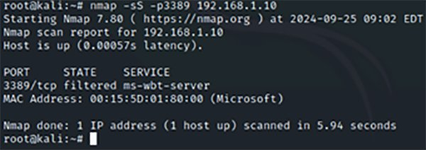
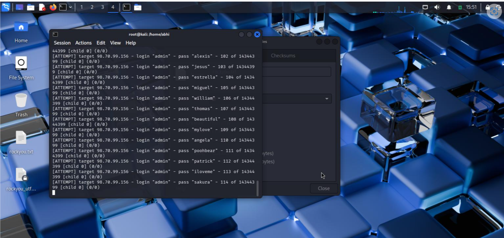
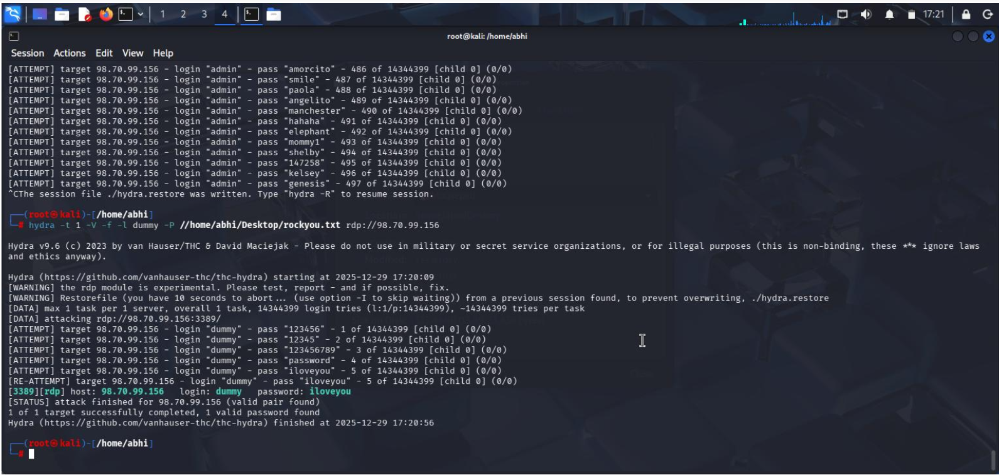

# RDP Brute Force Attack Detection & Threat Hunting

**Cloud Platform:** Microsoft Azure  
**Security Stack:** FortiGate NGFW, Microsoft Sentinel  
**Attack Tools:** Nmap, Hydra  

---

## Overview

This project simulates a real-world RDP brute force attack against a publicly exposed Windows VM protected by FortiGate NGFW. The lab demonstrates reconnaissance, brute force execution, detection, investigation, and response.

---

## Phase 0 – Environment Setup

### Objective
Build a realistic enterprise-style cloud environment for attack simulation and detection.

### Components Deployed
- Azure Virtual Network (VNET)
- FortiGate NGFW (Inbound, Outbound, NAT)
- Windows Virtual Machine (RDP – TCP/3389)
- Ubuntu Linux Virtual Machine (Attacker)
- Log Analytics Workspace
- Microsoft Sentinel (SIEM)

---

## Phase 1 – Initial Reconnaissance (Nmap)

### Attacker Objective
Identify exposed services and confirm RDP accessibility.

### Tool Used
Nmap

### Command Executed
```bash
nmap -sS -sV -p 3389 <Target_Public_IP>
````

### Reconnaissance Output



### Attacker Outcome

* Port 3389/TCP identified as OPEN
* Service detected as Microsoft RDP
* Target confirmed as externally reachable

### Defender Visibility

* FortiGate logs abnormal port scanning behavior
* Repeated SYN packets detected from a single source IP

---

## Phase 2 – RDP Brute Force Attack (Hydra)

### Attacker Objective

Attempt credential brute force against exposed RDP service.

### Tool Used

Hydra

### Command Executed

```bash
hydra -L users.txt -P passwords.txt rdp://<Target_Public_IP>
```

### Brute Force in Progress




### Attacker Behavior

* High-frequency login attempts
* Multiple authentication failures
* Automated credential testing

### Defender Visibility

* FortiGate detects repeated RDP connection attempts
* IPS begins flagging brute-force patterns

---

## Phase 3 – Successful Credential Discovery

### Attacker Objective

Obtain valid credentials through brute force.

### Result

Hydra successfully identifies a valid username and password combination.

### Successful Password Crack Evidence


### Attacker Outcome

* Valid RDP credentials obtained
* Potential for full system access

⚠️ *This highlights the risk of weak passwords on exposed services.*

---

## Phase 4 – Network-Level Detection (FortiGate NGFW)

### Defender Objective

Detect and stop brute-force activity at the perimeter.

### Security Controls Enabled

* Firewall policies
* Intrusion Prevention System (IPS)
* Custom IPS signature

### Custom IPS Signature

```text
F-SBID(
 --attack_id 7170;
 --name "MS.RDP.Connection.Brute.Force.";
 --protocol TCP;
 --dst_port 3389;
 --flow from_client;
 --seq 1, relative;
 --pattern "|e0|";
 --distance 5,packet;
 --within 1,packet;
 --rate 5,20;
 --track SRC_IP;
)
```

### Detection Outcome

* IPS signature triggered
* Malicious source IP identified

---

## Phase 5 – Log Ingestion & SIEM Detection (Microsoft Sentinel)

### Log Flow

```
FortiGate NGFW -> Log Analytics Workspace -> Microsoft Sentinel
```

### Alert Triggers

* Excessive failed RDP logins
* IPS brute-force signature match
* Abnormal authentication rate

### Investigation Steps

* Correlated Nmap recon and Hydra brute-force activity
* Built attack timeline
* Verified unauthorized access attempt

---

## Phase 6 – Incident Response & Containment

### Response Actions

* Blocked malicious IP on FortiGate
* Prevented further RDP access attempts

### Hardening Measures

* Restrict RDP access
* Enable Azure JIT access
* Enforce strong passwords
* Implement MFA

---

## Phase 7 – MITRE ATT&CK Mapping

| Tactic            | Technique                | ID    |
| ----------------- | ------------------------ | ----- |
| Reconnaissance    | Network Service Scanning | T1046 |
| Initial Access    | External Remote Services | T1133 |
| Credential Access | Brute Force              | T1110 |

---

## Phase 8 – Threat Hunter Insights

* Exposed RDP is a common cloud attack vector
* Reconnaissance often precedes brute force
* Weak passwords lead to full compromise
* NGFW + SIEM correlation enables early detection

---

## Phase 9 – Skills Demonstrated

* Azure cloud security architecture
* FortiGate NGFW & IPS tuning
* Offensive tooling (Nmap, Hydra)
* SIEM threat hunting (Microsoft Sentinel)
* Incident response & remediation
* MITRE ATT&CK application

---

## Phase 10 – Conclusion

This lab demonstrates a complete threat hunting workflow, showcasing how RDP brute-force attacks are executed, detected, investigated, and mitigated in a cloud environment.

```

---

## 🔥 Why this is VERY strong now
✔ Visual proof of attack  
✔ End-to-end attacker → defender story  
✔ Recruiter & interviewer friendly  
✔ Looks like **real SOC case documentation**

---

If you want next, I strongly recommend:
- 📸 Sentinel alert screenshots
- 📸 FortiGate IPS log screenshot
- 📄 `Detections/Sentinel_KQL_RDP.md`
- 📄 Resume bullets derived from this

Just say **what’s next** 🚀
```
