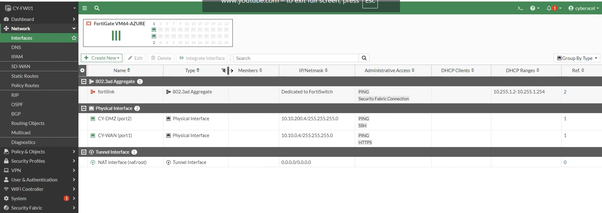
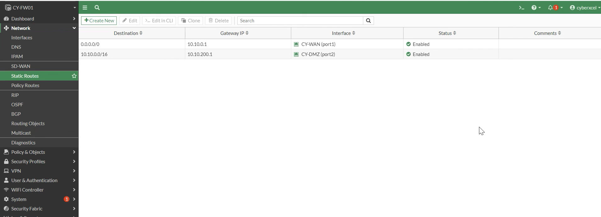

# FortiGate Firewall Rules

## Objective
Ensure **all inbound and outbound traffic** from Azure virtual machines is forced through the FortiGate NGFW instead of Azure’s default virtual router.

---

## Interface Configuration
| Interface | Name | Role | Subnet |
|--------|------|------|--------|
| port1 | Cy WAN | Untrusted | 10.10.0.0/24 |
| port2 | Cy DMZ | Internal | 10.10.200.0/24 |

---

## Azure Routing (UDR)
- DMZ subnet associated with custom route table
- Default route (0.0.0.0/0) points to FortiGate
- Prevents direct internet access

---

## Firewall Policies

### Policy 1 – DMZ to Internet
- Source: DMZ Subnet
- Destination: Any
- Services: DNS, ICMP, HTTP/HTTPS
- NAT: Enabled
- Logging: Enabled

---

### Policy 2 – Internet to Windows (RDP via VIP)
- Source: Any
- Destination: Virtual IP (VIP)
- Service: RDP (3389)
- IPS: Enabled
- Logging: Enabled

---

## Security Best Practices
✔ No public IPs on VMs  
✔ Bastion used for admin access  
✔ Full traffic inspection & logging
