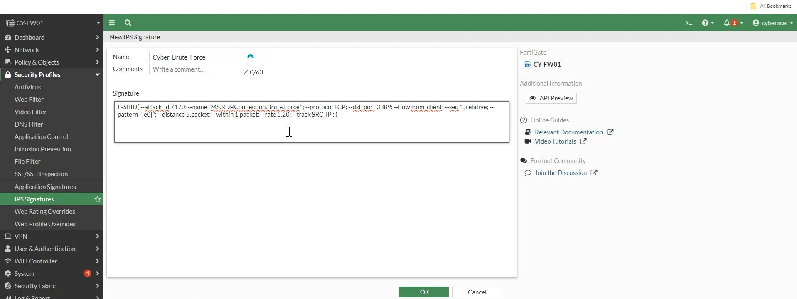

# Custom IPS Signature – RDP Brute Force

## Purpose
Detect and block RDP brute-force attacks targeting Windows systems.

---

## Custom IPS Signature


```text
F-SBID( --attack_id 7170; --name "MS.RDP.Connection.Brute.Force."; --protocol TCP; --dst_port 3389; --flow from_client; --seq 1, relative; --pattern "|e0|"; --distance 5,packet; --within 1,packet; --rate 5,20; --track SRC_IP ; )
