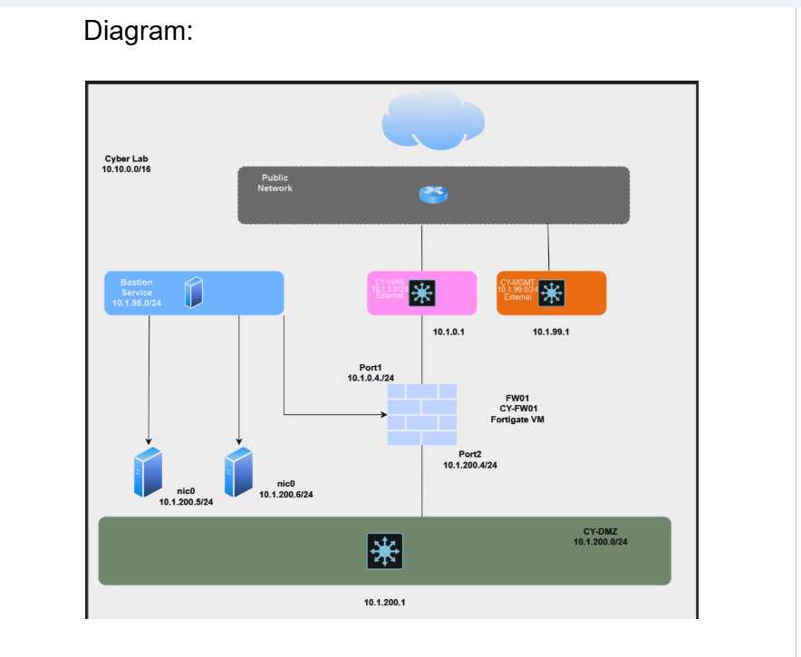

# NGFW & Microsoft Sentinel – Threat Hunting Portfolio (Azure)

## 📌 Project Overview
This repository documents a real-world **Threat Hunting & Incident Response lab** implemented in **Microsoft Azure** using a **FortiGate Next-Generation Firewall (NGFW)** integrated with **Microsoft Sentinel (SIEM/SOAR)**.

The lab simulates an enterprise-like cloud environment where publicly accessible virtual machines are protected by an NGFW. Controlled attacks such as **RDP brute-force** and **network scanning** are generated to validate detection, alerting, and response capabilities.

This project demonstrates hands-on skills expected from a **SOC Analyst / Threat Hunter / Cloud Security Engineer**.

---

## 🧱 Architecture
- **Cyber Lab VNET:** 10.10.0.0/16
- **DMZ Subnet:** 10.1.200.0/24
- **Bastion Subnet:** 10.1.98.0/24
- **Firewall:** FortiGate-VM
- **SIEM:** Microsoft Sentinel

---

## 🎯 Threat Hunting Objectives
- Detect RDP brute-force attacks
- Identify network reconnaissance activity
- Analyze NGFW & SIEM telemetry
- Create Sentinel alerts and incidents
- Perform firewall-based incident response
- Map activity to MITRE ATT&CK

---

## 🧪 Attack Scenarios
- RDP Brute Force (TCP/3389)
- Network Scanning (Nmap)

---

## 🛡️ Security Controls
- FortiGate firewall rules
- NAT & inbound filtering
- IPS with custom signature
- Centralized logging to Sentinel

---

## 🚨 Incident Response
- Alert creation in Sentinel
- Investigation using firewall logs
- Blocking malicious IPs on FortiGate
- Incident closure with documentation

---

## 📊 MITRE ATT&CK Coverage
| Technique | Name |
|--------|------|
| T1110 | Brute Force |
| T1046 | Network Service Scanning |

---

## 📌 Author
**Kumar Abhinav**  
Threat Hunter | SOC Analyst | Cloud Security
