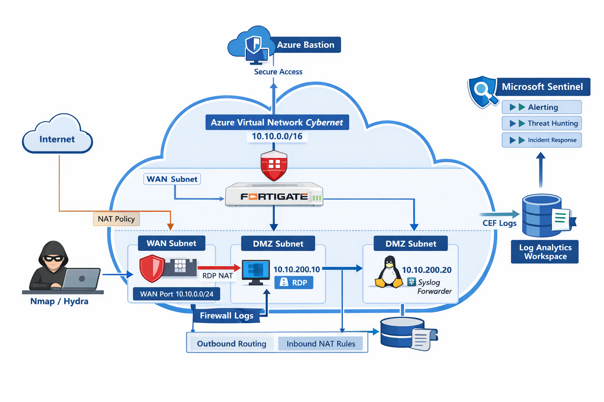

# 🔐 NGFW-Sentinel Threat Hunting Lab (Azure SOC Project)

A **production-style SOC threat hunting lab** built in **Microsoft Azure** using a **FortiGate Next-Generation Firewall (NGFW)** and **Microsoft Sentinel SIEM**.

This project simulates **real-world attack scenarios** such as **RDP Brute Force and Network Scanning**, enforces security using **custom IPS signatures**, and performs **end-to-end detection, alerting, and incident investigation** mapped to the **MITRE ATT&CK framework**.

---

## 🎯 Project Goals

The primary objectives of this project are:

- Build a **realistic SOC lab** in Azure Cloud
- Force **all traffic through a NGFW** (no default Azure routing)
- Simulate **external attacker behavior**
- Detect attacks using **Firewall + Sentinel logs**
- Create **manual & scheduled alerts** in Sentinel
- Perform **threat hunting using KQL**
- Map all attacks to **MITRE ATT&CK**
- Prepare a **job-ready SOC portfolio**

---

## 🏗️ High-Level Architecture



This lab follows a **firewall-centric zero-trust design**.

### Core Components

- **Azure Virtual Network (VNet)**
- **FortiGate NGFW**
- **Windows 10 Victim VM (RDP exposed via NAT)**
- **Linux VM (Attacker + Syslog Forwarder)**
- **Azure Bastion (secure VM access)**
- **Log Analytics Workspace**
- **Microsoft Sentinel (SIEM)**

📌 All inbound and outbound traffic is **forced through FortiGate** using **custom route tables**.

📷 Architecture Diagram:  
`Architecture/Azure_NGFW_Diagram.png`

---

## 🔁 Traffic Flow Summary

1. Internet → FortiGate Firewall
2. FortiGate NAT → Windows VM (RDP)
3. Firewall Logs → Linux Syslog VM
4. Linux Syslog → Log Analytics Workspace
5. Sentinel → Detection, Alerts, Incidents

---

## 🔴 Attack Scenarios Implemented

### 1️⃣ RDP Brute Force Attack
- External attacker attempts multiple username/password combinations
- Attack performed using **Hydra**
- FortiGate IPS detects brute-force behavior
- Custom IPS signature blocks further attempts
- Sentinel generates **High severity incident**

📄 Documentation:  
`Attacks/RDP_Brute_Force.md`

---

### 2️⃣ Network Scanning (Reconnaissance)
- Attacker performs port and service discovery
- Scanning done using **Nmap**
- Firewall logs reveal reconnaissance activity
- Useful for early attack detection

📄 Documentation:  
`Attacks/Network_Scanning.md`

---

## 🔍 Detection & Threat Hunting Approach

### Log Sources
- FortiGate Firewall (CEF format)
- Windows Security Events
- Syslog (Linux)

### Key Events Monitored
- Multiple failed RDP logins (4625)
- Successful RDP access (4624)
- IPS UTM events
- External IP reconnaissance behavior

### Threat Hunting Techniques
- KQL-based hypothesis hunting
- Source IP correlation
- Time-based brute force analysis
- IPS signature validation

---

## 🛡️ Firewall & IPS Configuration

### Firewall Capabilities Used
- Network policies
- NAT (VIP for RDP)
- Application control
- Intrusion Prevention System (IPS)

### IPS Highlights
- Default IPS signatures tested
- Custom IPS signature created for:
  - RDP Brute Force detection
  - Threshold-based blocking

📄 Firewall Docs:
- `Firewall/Firewall_Rules.md`
- `Firewall/IPS_Custom_Signature.md`

---

## 📊 Microsoft Sentinel Integration

### Why Sentinel?
- Centralized SIEM
- Powerful KQL hunting
- Incident lifecycle management
- MITRE ATT&CK mapping

### Sentinel Capabilities Used
- Log Analytics Workspace
- FortiGate Data Connector
- Analytics Rules (Scheduled Queries)
- Manual Alert Creation
- Incident Investigation

📄 Sentinel Docs:
- `Sentinel/Analytics_Rules.md`
- `Sentinel/Incident_Response.md`

---

## 🚨 Alerting & Incident Response

### Alert Details
- Rule Type: Scheduled Query
- Severity: **High**
- Frequency: Every 5 minutes
- Entity Mapping: Attacker IP
- MITRE Technique Mapping applied

### Incident Investigation
- Identify attacker IP
- Review IPS signature triggered
- Validate firewall block
- Document response actions

---

## 🧠 MITRE ATT&CK Mapping

This project strictly follows **MITRE ATT&CK Enterprise Framework**.

Mapped Techniques Include:

| Tactic | Technique | ID |
|-----|---------|----|
| Reconnaissance | Network Service Scanning | T1046 |
| Credential Access | Brute Force | T1110.001 |
| Lateral Movement | Remote Services (RDP) | T1021.001 |

📄 Full Mapping:  
`MITRE/ATTACK_Mapping.md`

---

## 🧰 Tools & Technologies Used

- Microsoft Azure
- FortiGate NGFW
- Microsoft Sentinel (SIEM)
- Log Analytics Workspace
- Linux (Ubuntu)
- Windows 10
- Nmap
- Hydra
- Syslog
- KQL
- MITRE ATT&CK

---

## 📂 Repository Structure

```plaintext
NGFW-Sentinel-Threat-Hunting/
│── README.md
│── Architecture/
│   └── Azure_NGFW_Diagram.png
│── Attacks/
│   ├── RDP_Brute_Force.md
│   └── Network_Scanning.md
│── Firewall/
│   ├── Firewall_Rules.md
│   └── IPS_Custom_Signature.md
│── Sentinel/
│   ├── Analytics_Rules.md
│   └── Incident_Response.md
│── MITRE/
│   └── ATTACK_Mapping.md
│── Screenshots/
